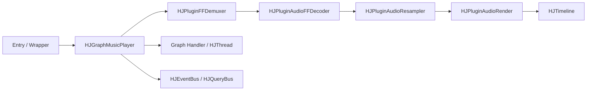

# HJGraphMusicPlayer Architecture

## Purpose
This document describes the actual architecture and control semantics of `HJGraphMusicPlayer`.

It is written for:
- LLMs that need stable context before editing player code
- maintainers who need to recover the design quickly
- other readers who want to understand the pure-audio player graph

## One-Sentence Summary
`HJGraphMusicPlayer` is the pure-audio playback graph in `hjmedia`. It assembles the demux, decode, resample, and render chain, and coordinates graph-level policy such as seek serialization, repeat handling, timeline access, and final EOF delivery.

## Scope
This module is responsible for:
- opening an audio source
- controlling playback state such as pause, resume, seek, mute, volume, and track switch
- exposing playback time through `HJTimeline`
- coordinating repeat and final EOF behavior across plugins

This module is not responsible for:
- video rendering
- complex UI state management
- a strong reusable `close()` / stop contract

## Code Location
Core implementation:
- [HJGraphMusicPlayer.h](/f:/Source/hjmedia/src/graphs/HJGraphMusicPlayer.h)
- [HJGraphMusicPlayer.cpp](/f:/Source/hjmedia/src/graphs/HJGraphMusicPlayer.cpp)

Key dependencies:
- [HJTimeline.md](/f:/Source/hjmedia/src/plugins/doc/HJTimeline.md)
- [HJPluginDemuxer.md](/f:/Source/hjmedia/src/plugins/doc/HJPluginDemuxer.md)
- [HJPluginAudioFFDecoder.md](/f:/Source/hjmedia/src/plugins/doc/HJPluginAudioFFDecoder.md)
- [HJPluginAudioResampler.md](/f:/Source/hjmedia/src/plugins/doc/HJPluginAudioResampler.md)
- [HJPluginAudioRender.md](/f:/Source/hjmedia/src/plugins/doc/HJPluginAudioRender.md)
- [HJThread README](/f:/Source/hjmedia/src/utils/HJThread/doc/README.md)

## Component Diagram

## Initialization Flow
The high-level initialization sequence is:

1. initialize graph-level base infrastructure
2. register event and query handlers
3. create the graph's own control thread and handler
4. create render and audio worker threads
5. create `HJTimeline`
6. create the demuxer, decoder, resampler, and audio render plugins
7. connect the plugin chain
8. initialize plugins and pass required thread / timeline / audio-format state

The graph's own handler exists mainly so that seek requests can be serialized instead of being executed directly on the caller thread.

## Core Data Path
Main path:

`openURL -> demux -> decode -> resample -> render -> timeline`

Meaning of each step:
- demuxer reads compressed packets from the media source
- audio decoder turns packets into decoded audio frames
- resampler converts or repacks audio into the target output format
- audio render consumes PCM and drives the actual playback head
- timeline exposes current playback progress to the graph and callers

## Core Control Path
Important control operations:

- `openURL()`
  - forwarded to the demuxer
- `pause()`
  - pauses timeline progression and pauses render-side playback
- `resume()`
  - resumes render-side playback and restarts timeline progression
- `seek()`
  - posted to the graph's own handler instead of directly driving the demuxer
- `switchAudioTrack()`
  - currently uses a lightweight direct demuxer-side switch
- `setRepeats()`
  - updates graph-level repeat policy used later during EOF handling

## Thread Model
At least three thread roles matter here:

### Graph control thread
Owned by the graph itself.

Used for:
- the graph handler
- serializing seek requests
- isolating graph-level control sequencing from arbitrary caller threads

### Audio worker thread
Used by audio-processing plugins such as decoder and resampler.

### Render thread
Used to support render-side asynchronous behavior. Exact details still depend on the concrete platform render implementation.

## Important Threading Constraints
- `seek()` is asynchronous from the API caller's point of view.
- fast repeated seek requests are coalesced through handler-side clearing semantics instead of being naively queued forever.
- playback timestamp meaning depends on render-side progress, not decode-side progress.
- teardown and delayed task reasoning must be checked together with `HJThread` weak-target semantics.

## Timeline Semantics
`getCurrentTimestamp()` is primarily backed by `HJTimeline`.

For this graph, the important interpretation is:
- the visible playback head is effectively audio-render-driven
- the graph does not invent its own independent playback clock

This is a critical design choice. If render-side pause, buffering, or teardown semantics change, timestamp behavior may also change.

## Repeat And EOF Policy
There are two different EOF concepts in this graph.

### Demuxer EOF
Demuxer EOF means the source has no more upstream input to provide.

At that point, the graph decides whether to:
- reset for another repeat cycle
- or mark that final EOF is now pending

### Final playback EOF
Final playback EOF is reported only after render-side consumption reaches its terminal condition.

This distinction is intentional:
- demuxer EOF means "no more source data"
- final playback EOF means "the user has effectively played through the end"

This separation should be preserved during later refactors.

## Timestamp Clamping After Final EOF
After final audio playback completion, the graph stores the last valid playback time and clamps future `getCurrentTimestamp()` results to that maximum.

Why this matters:
- it prevents playback time from continuing to drift forward after terminal completion
- it keeps post-EOF UI and state queries stable

## Audio Track Switching
Current track switching is lightweight:
- validate requested track
- if already selected, do nothing
- otherwise ask the demuxer to switch

The codebase still suggests room for a heavier future design involving seek / flush / resume coordination, so this area should be treated as evolvable rather than fully closed.

## Lifecycle Notes

### `close()`
Current `close()` behavior is weak and should not be interpreted as a full teardown contract.

Practical implication:
- wrapper layers should not assume `close()` fully releases the playback pipeline
- stronger stop/reuse semantics require additional design, not just wrapper naming

### `done()` / internal release
Actual teardown happens in release-oriented paths that clear plugins, threads, timeline, and graph-owned infrastructure.

## Known Risks
- `close()` semantics are weak and easy to over-assume.
- seek is asynchronous and can be misunderstood by wrappers or callers.
- timeline meaning depends on render behavior.
- final EOF depends on multiple graph-level state variables and plugin-side progress.
- track switching likely still has future refinement space.

## What LLMs Should Read Next
Recommended reading order after this document:
1. [HJGraphMusicPlayer_AudioContextGuide.md](/f:/Source/hjmedia/docs/architecture/HJGraphMusicPlayer_AudioContextGuide.md)
2. [HJThread README](/f:/Source/hjmedia/src/utils/HJThread/doc/README.md)
3. [HJTimeline.md](/f:/Source/hjmedia/src/plugins/doc/HJTimeline.md)
4. [HJPluginDemuxer.md](/f:/Source/hjmedia/src/plugins/doc/HJPluginDemuxer.md)
5. [HJPluginAudioFFDecoder.md](/f:/Source/hjmedia/src/plugins/doc/HJPluginAudioFFDecoder.md)
6. [HJPluginAudioResampler.md](/f:/Source/hjmedia/src/plugins/doc/HJPluginAudioResampler.md)
7. [HJPluginAudioRender.md](/f:/Source/hjmedia/src/plugins/doc/HJPluginAudioRender.md)

## Recommended Review Focus
When reviewing code around this graph, focus on:
- whether thread ownership of control actions is still correct
- whether seek semantics remain serialized and asynchronous
- whether timeline meaning still matches render-side progress
- whether demux EOF and final playback EOF are still distinct
- whether teardown leaves delayed tasks or stale callbacks behind
