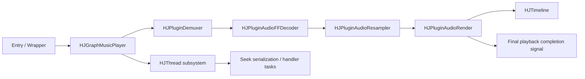

# HJGraphMusicPlayer Audio Context Guide

## Purpose
This guide closes the gap between two documentation clusters:
- the `HJThread` subsystem docs
- the `HJGraphMusicPlayer` audio-chain docs

Its job is to give LLMs and human readers a stable reading path before they touch code in the music player stack.

## When To Read This First
Read this guide first if your task involves any of the following:
- understanding the player without cold-reading all source files
- debugging seek, EOF, repeat, or teardown behavior
- reviewing thread ownership or delayed task delivery
- changing one plugin in the audio chain and wanting to understand its upstream/downstream effects

## Mental Model
The music player is easiest to understand as two layers working together:

1. Control / scheduling layer
Driven by `HJThread` primitives:
- `HJLooperThread`
- `HJLooper`
- `HJHandler`
- `HJMessageQueue`
- `HJMessage`

2. Audio data path layer
Driven by graph/plugin composition:
- `HJPluginDemuxer`
- `HJPluginAudioFFDecoder`
- `HJPluginAudioResampler`
- `HJPluginAudioRender`
- `HJTimeline`
- `HJGraphMusicPlayer`

The first layer answers:
- which thread owns this action
- whether work is immediate, delayed, or synchronous
- how shutdown and stale task delivery behave

The second layer answers:
- where audio data flows
- where playback time comes from
- where EOF is observed and finalized
- where seek and repeat policy are coordinated

## Relationship Diagram



## Recommended Reading Order

### Path A: You are new to the player
1. [HJGraphMusicPlayer.md](/f:/Source/hjmedia/docs/architecture/HJGraphMusicPlayer.md)
2. [HJThread README](/f:/Source/hjmedia/src/utils/HJThread/doc/README.md)
3. [HJLooperThread.md](/f:/Source/hjmedia/src/utils/HJThread/doc/HJLooperThread.md)
4. [HJHandler.md](/f:/Source/hjmedia/src/utils/HJThread/doc/HJHandler.md)
5. [HJTimeline.md](/f:/Source/hjmedia/src/plugins/doc/HJTimeline.md)
6. [HJPluginDemuxer.md](/f:/Source/hjmedia/src/plugins/doc/HJPluginDemuxer.md)
7. [HJPluginAudioFFDecoder.md](/f:/Source/hjmedia/src/plugins/doc/HJPluginAudioFFDecoder.md)
8. [HJPluginAudioResampler.md](/f:/Source/hjmedia/src/plugins/doc/HJPluginAudioResampler.md)
9. [HJPluginAudioRender.md](/f:/Source/hjmedia/src/plugins/doc/HJPluginAudioRender.md)
10. [HJGraphMusicPlayer.cpp](/f:/Source/hjmedia/src/graphs/HJGraphMusicPlayer.cpp)

### Path B: You are debugging thread or teardown issues
1. [HJThread README](/f:/Source/hjmedia/src/utils/HJThread/doc/README.md)
2. [HJLooperThread.md](/f:/Source/hjmedia/src/utils/HJThread/doc/HJLooperThread.md)
3. [HJLooper.md](/f:/Source/hjmedia/src/utils/HJThread/doc/HJLooper.md)
4. [HJHandler.md](/f:/Source/hjmedia/src/utils/HJThread/doc/HJHandler.md)
5. [HJMessageQueue.md](/f:/Source/hjmedia/src/utils/HJThread/doc/HJMessageQueue.md)
6. [HJMessage.md](/f:/Source/hjmedia/src/utils/HJThread/doc/HJMessage.md)
7. [HJGraphMusicPlayer.md](/f:/Source/hjmedia/docs/architecture/HJGraphMusicPlayer.md)
8. [HJGraphMusicPlayer.cpp](/f:/Source/hjmedia/src/graphs/HJGraphMusicPlayer.cpp)

### Path C: You are debugging audio output or EOF behavior
1. [HJGraphMusicPlayer.md](/f:/Source/hjmedia/docs/architecture/HJGraphMusicPlayer.md)
2. [HJTimeline.md](/f:/Source/hjmedia/src/plugins/doc/HJTimeline.md)
3. [HJPluginAudioRender.md](/f:/Source/hjmedia/src/plugins/doc/HJPluginAudioRender.md)
4. [HJPluginAudioResampler.md](/f:/Source/hjmedia/src/plugins/doc/HJPluginAudioResampler.md)
5. [HJPluginAudioFFDecoder.md](/f:/Source/hjmedia/src/plugins/doc/HJPluginAudioFFDecoder.md)
6. [HJPluginDemuxer.md](/f:/Source/hjmedia/src/plugins/doc/HJPluginDemuxer.md)

## What Each Document Gives You
- [HJThread README](/f:/Source/hjmedia/src/utils/HJThread/doc/README.md)
  - the overall looper/handler mental model
- [HJLooperThread.md](/f:/Source/hjmedia/src/utils/HJThread/doc/HJLooperThread.md)
  - thread ownership, lifecycle, and shutdown constraints
- [HJHandler.md](/f:/Source/hjmedia/src/utils/HJThread/doc/HJHandler.md)
  - async, delayed, and sync call semantics
- [HJTimeline.md](/f:/Source/hjmedia/src/plugins/doc/HJTimeline.md)
  - what playback time means in this player
- [HJPluginDemuxer.md](/f:/Source/hjmedia/src/plugins/doc/HJPluginDemuxer.md)
  - async open/reset/seek behavior and demuxer generation control
- [HJPluginAudioFFDecoder.md](/f:/Source/hjmedia/src/plugins/doc/HJPluginAudioFFDecoder.md)
  - audio decode specialization on top of codec base logic
- [HJPluginAudioResampler.md](/f:/Source/hjmedia/src/plugins/doc/HJPluginAudioResampler.md)
  - format conversion, packing cadence, and FIFO semantics
- [HJPluginAudioRender.md](/f:/Source/hjmedia/src/plugins/doc/HJPluginAudioRender.md)
  - actual playback completion, buffering, and timeline updates
- [HJGraphMusicPlayer.md](/f:/Source/hjmedia/docs/architecture/HJGraphMusicPlayer.md)
  - graph-level policy: seek serialization, repeats, final EOF, and lifecycle coordination

## Key Cross-Cutting Facts
- `seek()` in `HJGraphMusicPlayer` is not immediate completion; it is serialized through the graph's own handler/thread.
- `HJTimeline` is effectively driven by audio render progress, not by demux or decode progress.
- demuxer EOF is not the same as final playback completion.
- final EOF is reported only after render-side consumption reaches the terminal condition.
- stale task delivery and teardown races must always be evaluated with `HJThread` weak-target semantics in mind.

## Suggested Codex Workflow
Use this workflow before editing code in this stack:

1. Read this guide.
2. Read the architecture doc for the graph.
3. Read only the thread docs needed for the current task.
4. Read only the plugin docs on the active path.
5. Then inspect source files for confirmation and exact code locations.

## Prompt Templates

### Prompt: Build Context
```text
先阅读 MusicPlayer 音频主链相关文档，不要修改代码。
阅读顺序：
1. docs/architecture/HJGraphMusicPlayer_AudioContextGuide.md
2. docs/architecture/HJGraphMusicPlayer.md
3. src/utils/HJThread/doc/README.md
4. src/plugins/doc/HJTimeline.md
5. src/plugins/doc/HJPluginDemuxer.md
6. src/plugins/doc/HJPluginAudioFFDecoder.md
7. src/plugins/doc/HJPluginAudioResampler.md
8. src/plugins/doc/HJPluginAudioRender.md
输出：
1. 这条链路的线程模型
2. 关键控制流
3. 关键数据流
4. 最容易改坏的 5 个点
要求：先基于文档建立上下文，再在必要时回到源码确认。
```

### Prompt: Thread + Audio Joint Review
```text
请联合阅读 HJThread 文档和 MusicPlayer 音频主链文档，不修改代码。
目标：审查一个改动是否会破坏线程语义或音频链路语义。
输出：
1. 涉及哪些线程/handler/queue
2. 涉及音频链路的哪个节点
3. 是否影响 seek / EOF / repeat / timeline
4. 需要重点检查的 teardown 风险
5. 建议回到哪些源码位置确认
```

## Recommended Review Focus
When reviewing changes in this stack, focus on:
- thread ownership of each control action
- stale delayed tasks after teardown
- whether timeline meaning is preserved
- whether demux EOF and final playback EOF are still distinguished
- whether one plugin change silently changes graph-level policy
