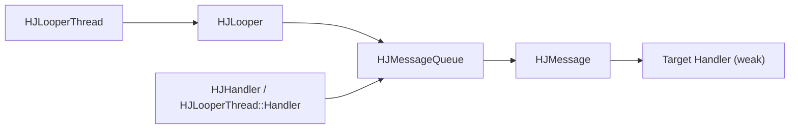

# HJThread Docs

## Purpose

This document is the entry point for the `HJThread` subsystem.

It serves three audiences:

1. LLMs / coding agents
Purpose: establish the thread/message-loop model before touching graph/plugin code that depends on it.

2. Maintainers
Purpose: quickly recall the relationships between `HJLooperThread`, `HJLooper`, `HJHandler`, `HJMessageQueue`, and `HJMessage`.

3. Other readers
Purpose: understand how asynchronous work, delayed tasks, synchronous cross-thread calls, and timer callbacks are implemented in this repository.

## What HJThread Is

`HJThread` is a lightweight message-loop threading subsystem inspired by the Android `Looper` / `Handler` model.

Core pieces:

- `HJLooperThread`: owns a real OS thread and runs a loop on it
- `HJLooper`: thread-local message loop
- `HJHandler`: posts callbacks/messages to a looper
- `HJMessageQueue`: time-ordered message queue with blocking wait / wakeup
- `HJMessage`: queue node and callback/message carrier

Typical usage in this repository:

- graph control threads
- plugin worker threads
- render/control serialization
- delayed retry / reset / seek scheduling
- timer-style callbacks built on top of handler messages

## Relationship Diagram

## Mental Model

The most useful way to understand this subsystem is:

1. `HJLooperThread` starts a thread.
2. That thread calls `HJLooper::prepare()` and creates one thread-local `HJLooper`.
3. `HJLooper::loop()` repeatedly pulls due messages from `HJMessageQueue`.
4. Each message is dispatched to its target `HJHandler`.
5. `HJHandler` either runs a posted callback or calls `handleMessage(...)`.

Everything else is built on top of that model:

- delayed work = message with future `when`
- sync cross-thread call = post callback + wait
- timer = repeatedly re-post delayed callback
- cancel = remove messages by `what` / `obj`

## Important Design Constraints

### One looper per looper thread

`HJLooper::prepare()` is only allowed:

- on a thread created by `HJLooperThread`
- once per thread

So this subsystem intentionally avoids arbitrary thread-local loop creation in unknown threads.

### Handler targets are weak

Messages store handler target as a weak reference.

Meaning:

- handler/object teardown does not require manually clearing every queued message first
- expired target messages are silently dropped and recycled

This is extremely important when reviewing teardown races in graph/plugin code.

### `done()` on looper thread is not supported

`HJLooperThread::beforeDone()` refuses shutdown from the looper thread itself.

Meaning:

- you must usually stop/destroy `HJLooperThread` from another thread
- teardown logic that runs inside the same looper must not directly destroy its own thread object

### Sync calls can still be tricky

`HJHandler::runWithScissors(...)` waits for execution on the target looper.

Even though it provides synchronous cross-thread execution, it still requires careful use:

- timeout may occur
- if misused, it can create deadlock chains
- if the task is already on the target looper, it runs inline instead

## Recommended Reading Order

If you or an LLM are new to this subsystem, read in this order:

1. [HJLooperThread.md](/f:/Source/hjmedia/src/utils/HJThread/doc/HJLooperThread.md)
2. [HJLooper.md](/f:/Source/hjmedia/src/utils/HJThread/doc/HJLooper.md)
3. [HJHandler.md](/f:/Source/hjmedia/src/utils/HJThread/doc/HJHandler.md)
4. [HJMessageQueue.md](/f:/Source/hjmedia/src/utils/HJThread/doc/HJMessageQueue.md)
5. [HJMessage.md](/f:/Source/hjmedia/src/utils/HJThread/doc/HJMessage.md)

Then inspect the code:

- [HJLooperThread.h](/f:/Source/hjmedia/src/utils/HJThread/HJLooperThread.h)
- [HJLooperThread.cpp](/f:/Source/hjmedia/src/utils/HJThread/HJLooperThread.cpp)
- [HJLooper.h](/f:/Source/hjmedia/src/utils/HJThread/HJLooper.h)
- [HJLooper.cpp](/f:/Source/hjmedia/src/utils/HJThread/HJLooper.cpp)
- [HJHandler.h](/f:/Source/hjmedia/src/utils/HJThread/HJHandler.h)
- [HJHandler.cpp](/f:/Source/hjmedia/src/utils/HJThread/HJHandler.cpp)
- [HJMessageQueue.h](/f:/Source/hjmedia/src/utils/HJThread/HJMessageQueue.h)
- [HJMessageQueue.cpp](/f:/Source/hjmedia/src/utils/HJThread/HJMessageQueue.cpp)

## Where This Matters In MusicPlayer

If your actual task is in the music player stack, do not stop at the thread docs. Continue with:

1. [HJGraphMusicPlayer_AudioContextGuide.md](/f:/Source/hjmedia/docs/architecture/HJGraphMusicPlayer_AudioContextGuide.md)
2. [HJGraphMusicPlayer.md](/f:/Source/hjmedia/docs/architecture/HJGraphMusicPlayer.md)
3. [HJTimeline.md](/f:/Source/hjmedia/src/plugins/doc/HJTimeline.md)
4. [HJPluginDemuxer.md](/f:/Source/hjmedia/src/plugins/doc/HJPluginDemuxer.md)
5. [HJPluginAudioFFDecoder.md](/f:/Source/hjmedia/src/plugins/doc/HJPluginAudioFFDecoder.md)
6. [HJPluginAudioResampler.md](/f:/Source/hjmedia/src/plugins/doc/HJPluginAudioResampler.md)
7. [HJPluginAudioRender.md](/f:/Source/hjmedia/src/plugins/doc/HJPluginAudioRender.md)

## What LLMs Should Do Before Editing

Before changing code that uses `HJThread`, the model should explicitly identify:

- which looper thread owns the work
- whether the call is async, delayed, or sync
- how shutdown happens
- whether callbacks may still arrive after owner teardown
- whether message cancellation is required or merely desirable

## Recommended Review Focus

When reviewing `HJThread` usage in other modules, prioritize:

1. shutdown from the correct thread
2. deadlock risk around sync calls
3. stale delayed task delivery after teardown
4. repeated timer/task cancellation behavior
5. whether weak-target dropping is acceptable for the caller
